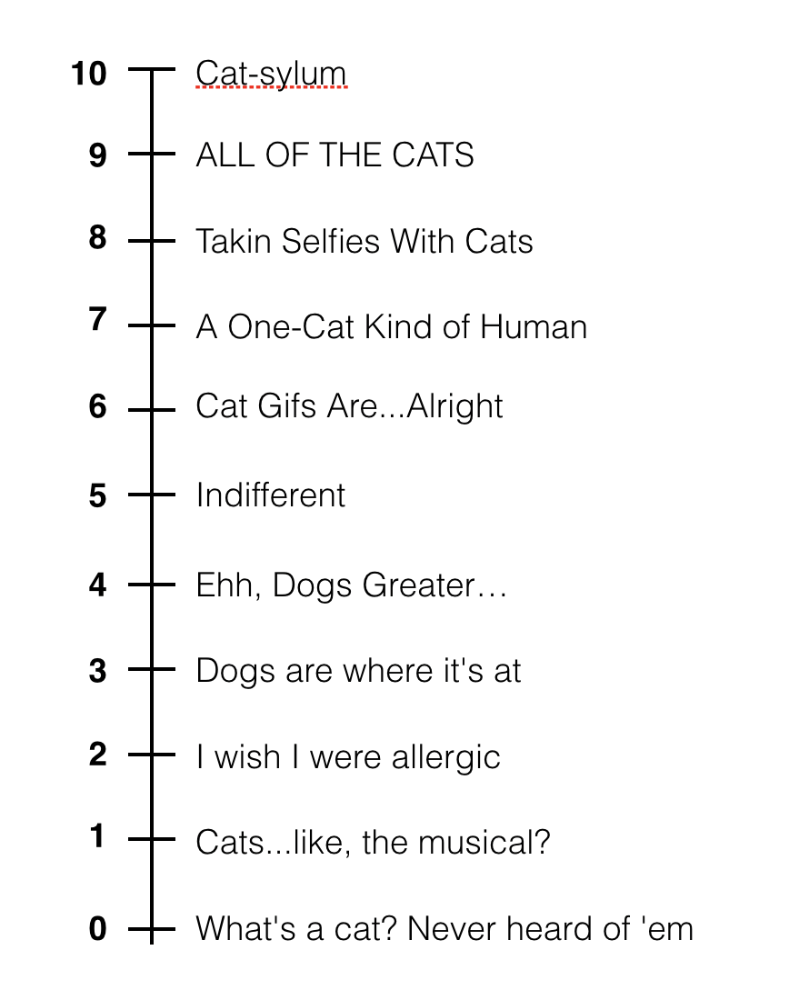
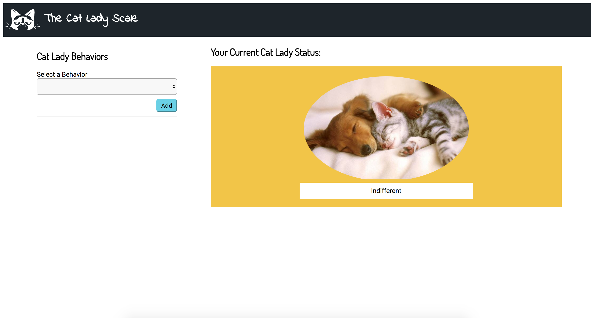

# The Cat Lady Scale

## How It Works
The Cat Lady Scale is a little web app that lets users calculate their place on the cat lady scale. What’s the Cat Lady Scale you ask?! The Cat Lady Scale is a rank of how much you love or don’t love cats. The scale ranges from 0-10 and each level has a title *(see scale below)*.

In the web app *(see picture below)*, users can choose from a list of behaviors that describes themselves. Every time they add a behavior, the selected behavior will be added to the list below the form. Each behavior is associated with a positive or negative point value. To determine a user's cat lady status, where a user is on the cat lady scale, all the point values from the selected behaviors must be added up. The total point value will be where they land on the scale. The user’s Cat Lady Status will be displayed on the right with the status title and a photo associated with it.

## To Get Started
1) Fork this Project to your Github account. Then clone that project to your local computer.   
2) Look over ALL CODE... checkout the html file... checkout the javascript file...  
3) Start working on the challenges.  

## Challenges
**There are challenge instructions here and in the javascript file. The challenges are placed in a particular order. The first challenges are made to be easier and with more instruction. As you move along and develop some sweet programming skills, the challenges should move with you and get harder and give less instructions. Now Proceed...**

1. Add More Cat Lady Behaviors - In the javascript file you will find a catLadyBehaviors array. Add some more Behavior objects to the list using the Behavior class constructor (as demonstrated with the existing entries in the catLadyBehaviors array. Each behavior needs a description (string) and a pointValue (positive or negative integer).

2. Implement the Add Behavior function in the Cat Lady Object - Add the passed in behavior object to the behavior list in the cat lady object (hint: you will have to use *this* to access the catLady's behaviors array). After you update the list, call the updateStatus function for this catLady (hint: again you will have to use *this*).

3. Implement the displayNewBehavior Function - Use jQuery to add the correct behavior item (div) to the behavior-list element (see html file). To do this, get the list item from the behavior object (see the behavior prototype) AND append the list item to the behavior list element in the html.

4. Prevent Page from Reload on Button Click - When buttons are clicked, the page automatically reloads. Go ahead, click the button and see what happens. So this is bad. Why is this bad?! because our javascript and all the variables it stores will be reset. We don't want that to happen on a button click. So with some jQuery, prevent the page from reload inside the add-behavior event handler. Don't know where to start? me neither. Let's google it.

5. Grab the Selected Behavior Information from the Behavior DropDown - Getting information from the HTML... jQuery! Before you start, try selecting different options in dropdown and observe what happens to the html, something in the <option> tags should change. Every time you select an option, the "selected" attribute moves to the option select (you can checkout the code that does this towards the bottom of the js file). You need to, first get the selected option element. Then get the value of that option element. It corresponds to the index of the selected behavior in the catLadyBehaviors array.

6. Add Behavior To CatLady Object - From the previous step, you should have the index of the corresponding behavior into catLadyBehaviors array. Grab that behavior and add it to the catLady Object.

7. Call the displayNewBehavior function - remember that function you implement in Step 3... now is the time to call it.

**CONGRATS! At this point you should be able to select a behavior, click the add button, and see it display below the form... all that work! Isn't javascript fun?!?!**

8. Calculate the PointValue sum of All the Cat Lady's behaviors - In the catLady object's updateStatus function, loop through all the catLady's behaviors to add up all pointValues. NOTE: When adding up the point values, start the sum at 5 (indifferent) then add and subtract from there.

9. Determine Where on The Scale the Cat Lady Is - Use the pointValue sum to figure out where on the scale this cat lady should be... So if the pointValue sum is a 5 -- the cat lady status will be the status located at 5 position in the CAT_LADY_SCALE object ("Indifferent"). If the sum is greater than 10, just use the status at 10. If the sum is negative and less than 0, just use the status at zero. Make sure to store the determined status, in the status property of your catLady object.

10. Back in the add-behavior click event... call the displayStatus function to update the cat lady display in the HTML.

11. Implement the displayStatus function - use jQuery to update the status display in the html. Make sure to checkout the Status object for help!
